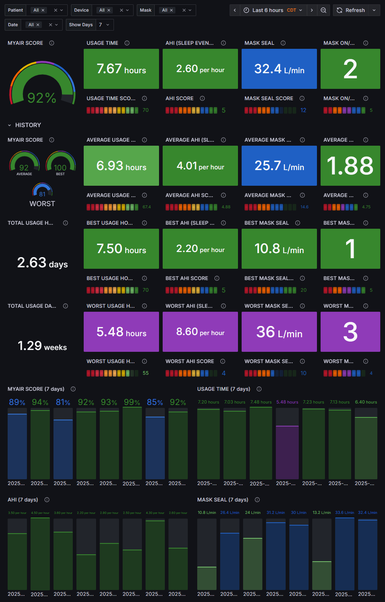

# MyAir Prometheus Exporter

This uses the rest client used in [HACS Resmed MyAir Sensors](https://github.com/prestomation/resmed_myair_sensors)

Exports data from MyAir for consumption by prometheus

## ENVIRONMENT VARIABLES

| NAME                          | DESCRIPTION                                                                                                   | DEFAULT      |
|-------------------------------|---------------------------------------------------------------------------------------------------------------|--------------|
| MAE_CONFIG_METRICS_ENABLED     | Enable or disable Prometheus metrics exporter                                                                 | true         |
| MAE_LOG_LEVEL                  | Logging level (e.g., DEBUG, INFO, WARNING, ERROR)                                                            | WARNING      |
| MAE_CONFIG_METRICS_PORT        | Port for Prometheus metrics endpoint                                                                          | 8933         |
| MAE_CONFIG_METRICS_POLLING_INTERVAL | Polling interval in seconds for metrics collection                                                    | 90           |
| MAE_MONGODB_USERNAME           | MongoDB username                                                                                             | mongouser    |
| MAE_MONGODB_PASSWORD           | MongoDB password                                                                                             | (required)   |
| MAE_MONGODB_HOST               | MongoDB host address                                                                                         | 127.0.0.1    |
| MAE_MONGODB_PORT               | MongoDB port                                                                                                 | 27017        |
| MAE_MONGODB_AUTHSOURCE         | MongoDB authentication database                                                                              | admin        |
| MAE_MONGODB_DATABASE           | MongoDB database name                                                                                        | myair        |
| MAE_MYAIR_RECORDS_DAYS         | Number of days of MyAir records to fetch                                                                     | 90           |
| MAE_MYAIR_INCLUDE_ZERO_SCORES  | Include records with zero scores ("TRUE" or "FALSE")                                                         | FALSE        |
| MAE_MYAIR_USERNAME_N           | MyAir account username                                                                                       | (required)   |
| MAE_MYAIR_PASSWORD_N           | MyAir account password                                                                                       | (required)   |
| MAE_MYAIR_DEVICE_TOKEN_N       | MyAir device token (optional, usually not required)                                                          | (empty)      |
| MAE_MYAIR_REGION_N             | MyAir region (e.g., NA, EU)                                                                             | NA           |

> [!NOTE]
> `MAE_MYAIR_<PROPERTY>_N` should replace `N` with an integer to indicate 1 or more users to populate data from.

## SAMPLE DATA

<!-- markdownlint-disable -->
``` text
# HELP myair_score_max The maximum score a patient can achieve.
# TYPE myair_score_max gauge
myair_score_max 100.0
# HELP myair_usage_score_max The maximum usage score a patient can achieve.
# TYPE myair_usage_score_max gauge
myair_usage_score_max 70.0
# HELP myair_mask_seal_score_max The maximum mask seal score a patient can achieve.
# TYPE myair_mask_seal_score_max gauge
myair_mask_seal_score_max 20.0
# HELP myair_mask_onoff_score_max The maximum mask on/off score a patient can achieve.
# TYPE myair_mask_onoff_score_max gauge
myair_mask_onoff_score_max 5.0
# HELP myair_ahi_score_max The maximum AHI score a patient can achieve.
# TYPE myair_ahi_score_max gauge
myair_ahi_score_max 5.0
# HELP myair_score_current myAir calculates your score by analyzing your nightly therapy data. The higher your score, the better. You get points based on the following four key categories: usage, mask seal, events, and mask on/off. The maximum score you can get is 100 points.
# TYPE myair_score_current gauge
myair_score_current{device="11111111111",mask="fake-mask-code",patient="00000000000000000000"} 100.0
# HELP myair_usage_current The MyAir usage time in seconds
# TYPE myair_usage_current gauge
myair_usage_current{device="11111111111",mask="fake-mask-code",patient="00000000000000000000"} 30360.0
# HELP myair_usage_score_current The point system for usage is calculated in hours and minutes. If you use your therapy for 1 hour you get 10 points, or for 2.3 hours (2 hours, 18 minutes) you get 23 points. The more time you use your therapy, the more points you receive, up to a maximum of 70 points.
# TYPE myair_usage_score_current gauge
myair_usage_score_current{device="11111111111",mask="fake-mask-code",patient="00000000000000000000"} 70.0
# HELP myair_mask_seal_current The better your mask seal, the more points you get. This category can help you know if you need to adjust or change your mask to get a better fit. If your mask seal is poor, it can affect your comfort and the quality of your treatment. Your score reduces as your mask leak increases. You can get up to 20 points for minimal mask leak, 10 to 15 points for moderate leak, and 0 to 10 points for higher leak.
# TYPE myair_mask_seal_current gauge
myair_mask_seal_current{device="11111111111",mask="fake-mask-code",patient="00000000000000000000"} 13.2
# HELP myair_mask_seal_score_current Your score reduces as your mask leak increases. You can get up to 20 points for minimal mask leak, 10 to 15 points for moderate leak, and 0 to 10 points for higher leak.
# TYPE myair_mask_seal_score_current gauge
myair_mask_seal_score_current{device="11111111111",mask="fake-mask-code",patient="00000000000000000000"} 20.0
# HELP myair_mask_onoff_count_current The MyAir mask on/off status. The fewer times you take your mask on and off throughout the night, the more points you get. Everyone has to take their mask on and off one time during treatment. So, for example, if you remove your mask one or two times, you get 5 points. However, if you take your mask on and off several times, it can indicate a problem with mask fit or with your sleep in general.
# TYPE myair_mask_onoff_count_current gauge
myair_mask_onoff_count_current{device="11111111111",mask="fake-mask-code",patient="00000000000000000000"} 2.0
# HELP myair_mask_onoff_score_current The MyAir mask on/off score. The fewer times you take your mask on and off throughout the night, the more points you get. 1-2: 5 points, 3: 4 points, 4: 3 points, 5: 2 points, 6 or more: 0 points.
# TYPE myair_mask_onoff_score_current gauge
myair_mask_onoff_score_current{device="11111111111",mask="fake-mask-code",patient="00000000000000000000"} 5.0
# HELP myair_ahi_current Your CPAP machine notes the number of breathing events you have in each hour. This number can help measure how well your treatment is working. When you have an apnea, air stops flowing to your lungs for 10 seconds or longer -- that is, you actually stop breathing.
# TYPE myair_ahi_current gauge
myair_ahi_current{device="11111111111",mask="fake-mask-code",patient="00000000000000000000"} 3.9
# HELP myair_ahi_score_current The fewer breathing events you have each hour, the more points you get. These breathing events are also known as the apnea-hypopnea index (or AHI). myAir measures how many times your breathing partially or fully stops each hour. If you have minimal events, you get 4 to 5 points.
# TYPE myair_ahi_score_current gauge
myair_ahi_score_current{device="11111111111",mask="fake-mask-code",patient="00000000000000000000"} 5.0
# HELP myair_patient A reference metric for the patient to be used in other metrics
# TYPE myair_patient gauge
myair_patient{ahi="120.0",id="00000000000000000000",name="John D"} 1.0
# HELP myair_device A reference metric for the device to be used in other metrics
# TYPE myair_device gauge
myair_device{image="https://static.myair-prd.dht.live/v1/flowgens/airsense_10_autoset/airsense_10_autoset.png",lastReportDate="2025-08-12",manufacturer="Resmed",name="AirSense 10 Respond",patient="00000000000000000000",serialNumber="11111111111",type="AS10"} 1.0
# HELP myair_mask A reference metric for the mask to be used in other metrics
# TYPE myair_mask gauge
myair_mask{code="fake-mask-code",image="https://static.myair-prd.dht.live//v1/masks/mirage_quattro/mirage_quattro_full_face_mask_plus_headgear.jpg",name="Mirage Quattro",patient="00000000000000000000",type="Full face"} 1.0
# HELP myair_score myAir calculates your score by analyzing your nightly therapy data. The higher your score, the better. You get points based on the following four key categories: usage, mask seal, events, and mask on/off. The maximum score you can get is 100 points.
# TYPE myair_score gauge
myair_score{date="2025-08-05",device="11111111111",mask="fake-mask-code",patient="00000000000000000000"} 89.0
...
myair_score{date="2025-08-12",device="11111111111",mask="fake-mask-code",patient="00000000000000000000"} 85.0
# HELP myair_usage_seconds The MyAir usage time in seconds
# TYPE myair_usage_seconds gauge
myair_usage_seconds{date="2025-08-05",device="11111111111",mask="fake-mask-code",patient="00000000000000000000"} 25920.0
...
myair_usage_seconds{date="2025-08-12",device="11111111111",mask="fake-mask-code",patient="00000000000000000000"} 23040.0
# HELP myair_usage_score The point system for usage is calculated in hours and minutes. If you use your therapy for 1 hour you get 10 points, or for 2.3 hours (2 hours, 18 minutes) you get 23 points. The more time you use your therapy, the more points you receive, up to a maximum of 70 points.
# TYPE myair_usage_score gauge
myair_usage_score{date="2025-08-05",device="11111111111",mask="fake-mask-code",patient="00000000000000000000"} 70.0
...
myair_usage_score{date="2025-08-12",device="11111111111",mask="fake-mask-code",patient="00000000000000000000"} 64.0
# HELP myair_mask_seal The better your mask seal, the more points you get. This category can help you know if you need to adjust or change your mask to get a better fit. If your mask seal is poor, it can affect your comfort and the quality of your treatment. Your score reduces as your mask leak increases. You can get up to 20 points for minimal mask leak, 10 to 15 points for moderate leak, and 0 to 10 points for higher leak.
# TYPE myair_mask_seal gauge
myair_mask_seal{date="2025-08-05",device="11111111111",mask="fake-mask-code",patient="00000000000000000000"} 36.0
...
myair_mask_seal{date="2025-08-12",device="11111111111",mask="fake-mask-code",patient="00000000000000000000"} 33.6
# HELP myair_mask_seal_score Your score reduces as your mask leak increases. You can get up to 20 points for minimal mask leak, 10 to 15 points for moderate leak, and 0 to 10 points for higher leak.
# TYPE myair_mask_seal_score gauge
myair_mask_seal_score{date="2025-08-05",device="11111111111",mask="fake-mask-code",patient="00000000000000000000"} 10.0
...
myair_mask_seal_score{date="2025-08-12",device="11111111111",mask="fake-mask-code",patient="00000000000000000000"} 11.0
# HELP myair_mask_onoff_count The MyAir mask on/off status. The fewer times you take your mask on and off throughout the night, the more points you get. Everyone has to take their mask on and off one time during treatment. So, for example, if you remove your mask one or two times, you get 5 points. However, if you take your mask on and off several times, it can indicate a problem with mask fit or with your sleep in general.
# TYPE myair_mask_onoff_count gauge
myair_mask_onoff_count{date="2025-08-05",device="11111111111",mask="fake-mask-code",patient="00000000000000000000"} 2.0
...
myair_mask_onoff_count{date="2025-08-12",device="11111111111",mask="fake-mask-code",patient="00000000000000000000"} 1.0
# HELP myair_mask_onoff_score The MyAir mask on/off score. The fewer times you take your mask on and off throughout the night, the more points you get. 1-2: 5 points, 3: 4 points, 4: 3 points, 5: 2 points, 6 or more: 0 points.
# TYPE myair_mask_onoff_score gauge
myair_mask_onoff_score{date="2025-08-05",device="11111111111",mask="fake-mask-code",patient="00000000000000000000"} 5.0
...
myair_mask_onoff_score{date="2025-08-12",device="11111111111",mask="fake-mask-code",patient="00000000000000000000"} 5.0
# HELP myair_ahi Your CPAP machine notes the number of breathing events you have in each hour. This number can help measure how well your treatment is working. When you have an apnea, air stops flowing to your lungs for 10 seconds or longer -- that is, you actually stop breathing.
# TYPE myair_ahi gauge
myair_ahi{date="2025-08-05",device="11111111111",mask="fake-mask-code",patient="00000000000000000000"} 8.6
...
myair_ahi{date="2025-08-12",device="11111111111",mask="fake-mask-code",patient="00000000000000000000"} 4.3
# HELP myair_ahi_score The fewer breathing events you have each hour, the more points you get. These breathing events are also known as the apnea-hypopnea index (or AHI). myAir measures how many times your breathing partially or fully stops each hour. If you have minimal events, you get 4 to 5 points.
# TYPE myair_ahi_score gauge
myair_ahi_score{date="2025-08-05",device="11111111111",mask="fake-mask-code",patient="00000000000000000000"} 4.0
...
myair_ahi_score{date="2025-08-12",device="11111111111",mask="fake-mask-code",patient="00000000000000000000"} 5.0
# HELP myair_total_days_count Total number of days the user has been using any device.
# TYPE myair_total_days_count gauge
myair_total_days_count{device="11111111111",lastReportDate="2025-08-12",mask="fake-mask-code",patient="00000000000000000000"} 8.0
# HELP myair_total_usage_seconds Total usage time of any device in seconds.
# TYPE myair_total_usage_seconds gauge
myair_total_usage_seconds{patient="00000000000000000000"} 199680.0
```
<!-- markdownlint-enable -->

## DASHBOARD


